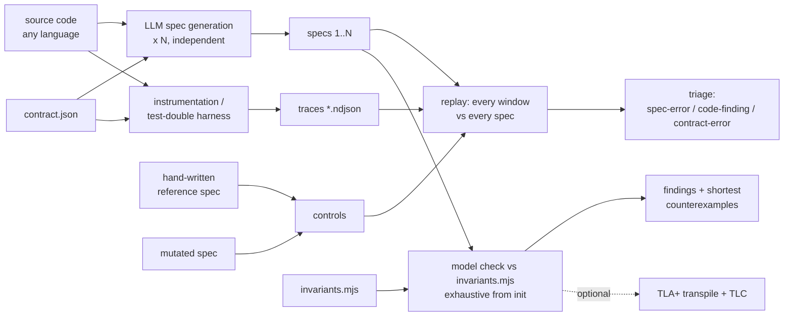
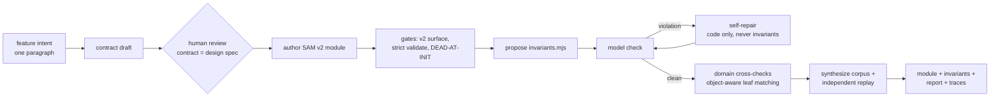
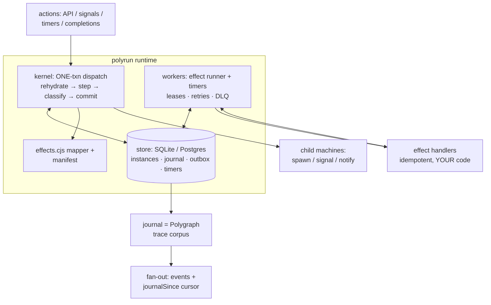

# Polygraph · polygen · polyrun — system architecture

Three engines around one artifact family. **Polygraph audits** stateful code
that already exists. **polygen authors** new stateful code so it is
verifiable from the moment it is written. **polyrun executes** verified
machines durably. Each is useful alone; together they close a loop in which
the same artifacts flow from design to verification to production and back.

> Scope disclosure (repo-wide): everything here is a **consistency check,
> not a proof**. A clean run means observable behavior matches an
> independent reading of the code within explored bounds — nothing more.

## The artifact family

Every engine consumes and produces the same small set of inspectable,
diffable artifacts:

| artifact | what it is | produced by | consumed by |
|---|---|---|---|
| `contract.json` | the audit/design scope: observable state keys, action alphabet, data domains, terminal states, named special rules | human, or polygen draft (human-reviewed) | everything |
| machine / spec (`next.cjs`) | an executable model: a **SAM v2 strict-profile module** (`{instance, init, actions, getState, setState}`) | polygen, or LLM spec generation from source | replay, model check, polyrun kernel |
| `invariants.mjs` | **intent**, as plain JS predicates over states (and transitions) | human (polygen proposes, human confirms) | model check, deploy gate |
| traces (`*.ndjson`) | ground truth: `{pre, action, data, post}` windows from the code actually executing | instrumentation, test harnesses, **the polyrun journal** | replay, audit |
| `effects.cjs` + `effects.manifest.json` | pure effect mapper over transitions + the declared effect vocabulary/completion wiring | polygen draft (human-reviewed) | polyrun kernel/workers, check-effects |

The `{pre, action, data, post}` **window** is the universal currency: the
replayer scores specs against it, the harness captures it, the polyrun
journal *is* a stream of it, and `stable()` (key-order-insensitive
canonical stringify in `scripts/load-spec.mjs`) is the single
state-equality definition every consumer shares.

## The SAM v2 strict profile — why it is the common substrate

All three engines depend on the same code shape
(`@cognitive-fab/sam-pattern`, vendored at `scripts/vendor/`): named intents
with schemas and **finite declared domains**, acceptors keyed per action, a
**sealed model** (no hidden bookkeeping state), and first-class
`reject(reason)` so every no-op is observable and classifiable via
`lastStep()`. Consequences:

- the model checker explores exactly what the module declares — zero
  harness configuration, no silently-unexplored actions;
- **rejection is a legal, observable no-op** — which is what makes stale
  timers, duplicate webhooks, and at-least-once redelivery safe in polyrun
  without any cancellation machinery;
- `getState()`/`setState()` round-trip totally over the declared shape —
  which is what makes snapshot-based durability (and replay-free deploys)
  sound;
- `instance({}).validate()` is a mechanical strict-clean gate at every
  stage boundary.

`scripts/sam-adapter.cjs` wraps any such module in the lean `{init, next}`
contract (reset-then-merge rehydration) so the BFS checker and the replayer
can never disagree about semantics.

## Engine 1 — Polygraph (audit)

Key properties:

- **Controls before trust**: a hand-written reference spec must replay
  100% and a deliberately mutated one must fail, proving the harness can
  tell good from bad, before any generated spec means anything.
- **N-way voting**: several independently generated specs; one bad
  generation cannot decide the outcome. Disagreements triage into
  spec-errors (LLM misread), code-findings (investigate), contract-errors
  (mis-scoped).
- **Replay finds unfaithfulness; the model check finds bugs**: a faithful
  spec reproduces the code's bugs, so replay alone cannot see them — the
  exhaustive iteration against *intent* invariants is what surfaces the
  reachable bad state, with a shortest action path as a ready repro.
- Source language is irrelevant (the spec is always JS): the
  `examples/polygraph-oms-go` audit derives specs from **Go** and captures
  ground truth by driving the unmodified Go workflow through Temporal's own
  testsuite.

## Engine 2 — polygen (author)

Key properties:

- **The repair loop fixes code, never invariants** — an invariant encodes
  intent by definition.
- Every stage boundary is gated: unloadable/truncated output retries once
  with the error fed back; a module that validates strict-clean but is
  **dead at init** (e.g. the `name:`-component local-state binding) is
  refused with the diagnosis in the retry prompt.
- The **contract/code domain cross-check** catches enum-spelling and
  domain-reference gaps between the two independent model calls (recursing
  into object-valued domain entries to their scalar leaves).
- A run that did not converge says so — the report never presents partial
  verification as clean, and recorded hand-repairs live next to the
  unconverged report (see `examples/polyrun-oms/machines/order/REPAIR-NOTE.md`).

## Engine 3 — polyrun (execute)

Full spec: `docs/polyrun-spec.md`. The short version:

- **Snapshot durability, not event-sourced replay**: rehydration is
  `init()+setState()`; deploys are gated on snapshot compatibility (plus
  model-checking live snapshots as initial states) — no determinism
  sandbox, no `patch()` versioning.
- **One transaction per step** (dedupe read included): journal row,
  snapshot, effect intents, and timers commit together or not at all.
  Effects are **emitted exactly once, executed at least once** under
  idempotency keys; completions dispatch before row marks on every path.
- **Poison doctrine**: anything "cannot happen" for a verified module —
  mid-step throws, unreadable classifications, rejected snapshots, mapper
  defects — durably poisons the *faulty* instance, loudly. A caller's
  schema-invalid payload is an observable reject, not a poison.
- **The verification flywheel**: `polyrun check-effects` explores the
  machine ∘ mapper composition against emission invariants ("no path emits
  chargeCard twice", "spawns exactly N children") reproducing the kernel's
  poison rules statically; `polyrun deploy` gates releases over live state;
  `polyrun audit` replays the production journal through the module and
  reports drift, version-aware.

## Trust boundaries

| layer | correctness argument |
|---|---|
| machine logic | exhaustive model check vs invariants (per machine) |
| machine ∘ mapper composition | check-effects path exploration incl. emissions, spawns, timer validity |
| kernel + stores + workers | conventional: fault-injection tests, soak, adversarial review — small, fixed, logic-free by design |
| effect handlers | **yours**: must be idempotent under the provided key (same division as Temporal activities) |
| contract & invariants | **human judgment** — the one thing no tool derives; a converged run against wrong intent proves nothing |

## Design doctrines (recurring, load-bearing)

1. **No silent-clean paths** — a run that verified nothing must never look
   like a pass (bounded exploration exits nonzero; empty invariant sets are
   refused; skipped instances are reported).
2. **Observable rejection** — every not-applicable action is
   `reject(reason)`, contract-anchored to the rule's name.
3. **Controls before trust** — positive and negative controls precede any
   generated-artifact claim.
4. **Ground truth is executed code** — traces come from the real thing
   running (instrumented app, test-double harness, or the polyrun journal),
   never from expectations.
5. **Defect → gate** — every generation/harness failure discovered becomes
   a mechanical gate so the next run cannot repeat it.

## Worked examples (the OMS trilogy)

- `examples/polyrun-oms` — Temporal's OMS reference app **rebuilt** on
  polyrun; every machine polygen-authored.
- `examples/polygraph-oms-go` — the same app's actual Go source
  **audited**: real-execution traces, controls, three generated specs,
  unanimous model-check findings.
- `polyrun/demo` — the kill -9 mid-charge recovery demo.

See `docs/SDLC.md` for how teams thread these engines into their
development lifecycle and agentic workflows.
