# Polygraph · polygen · polyrun · polyvers · polynv — system architecture

Five engines around one artifact family. **Polygraph audits** stateful code
that already exists. **polygen authors** new stateful code so it is
verifiable from the moment it is written. **polyrun executes** verified
machines durably. **polyvers evolves** them — gating every new version
against the live fleet, because state outlives code. **polynv elicits**
the invariants every other engine's guarantee is relative to — a
plugin-led interview over machine-harvested, pre-checked candidates,
graded for strength by mutation. Each is useful alone;
together they put TWO verification gates between authoring and execution —
the first version of a machine takes the correctness path (Polygraph),
every later version takes the compatibility path (polyvers) — and
execution feeds both gates back: the journal is the audit's trace corpus,
the fleet snapshots are the versioning gate's initial states.

> Scope disclosure (repo-wide): everything here is a **consistency check,
> not a proof**. A clean run means observable behavior matches an
> independent reading of the code within explored bounds — nothing more.
> And "exhaustive" is always exhaustive **over the finite (action, data)
> domains the contract or module declares**, never over unbounded real
> data. The precise coverage claim is *state machines expressible in the
> SAM v2 strict profile with finite declared domains* — control-dominated
> logic with finitizable data — not "arbitrary state machines". Behavior
> that depends on unbounded counters, amounts, or strings is checked only
> at the declared representative values (the standard model-bounding move,
> as in TLA+), and the abstraction gap between declared domain and real
> data is not measured by any gate.

[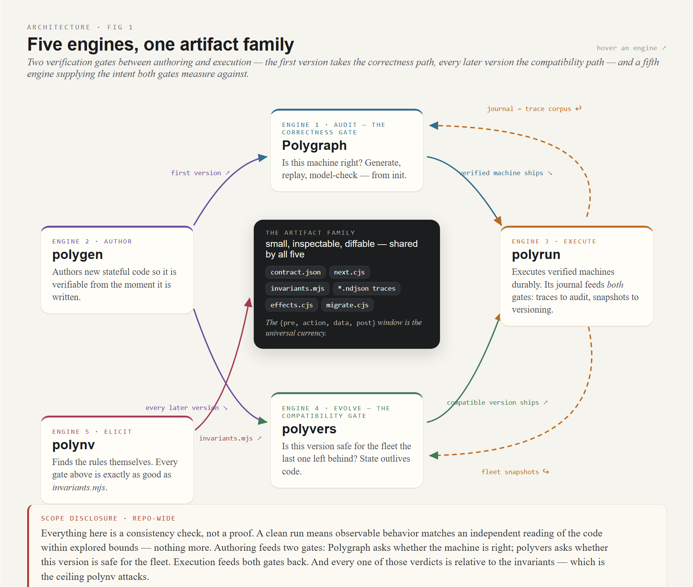](diagrams/architecture-01-five-engines.dc.html)
*Interactive diagram — [Five engines, one artifact family](diagrams/architecture-01-five-engines.dc.html) (hover an engine)*

## The artifact family

Every engine consumes and produces the same small set of inspectable,
diffable artifacts:

| artifact | what it is | produced by | consumed by |
|---|---|---|---|
| `contract.json` | the audit/design scope: observable state keys, action alphabet, data domains, terminal states, named special rules | human, or polygen draft (human-reviewed) | everything |
| machine / spec (`next.cjs`) | an executable model: a **SAM v2 strict-profile module** (`{instance, init, actions, getState, setState}`) | polygen, or LLM spec generation from source | replay, model check, polyrun kernel |
| `invariants.mjs` | **intent**, as plain JS predicates over states (and transitions) | human (polygen proposes, human confirms) | model check, deploy gate |
| traces (`*.ndjson`) | ground truth: `{pre, action, data, post}` windows from the code actually executing | instrumentation, test harnesses, **the polyrun journal** | replay, audit |
| `effects.cjs` + `effects.manifest.json` | pure effect mapper over transitions + the declared effect vocabulary/completion wiring | polygen draft (human-reviewed) | polyrun kernel/workers, check-effects, polyvers matrix |
| `migrate.cjs` | the pure shape migration for a version: `migrate(oldState) → newState` | polyvers scaffold (human fills the holes) | polyvers migrate gate, `polyrun migrate` |
| `compat-report.{json,md}` | the versioning verdict: lanes fired, gates run, corpus provenance, invariant-adequacy trust tier, one witness per violated rule — deterministic, PR-gateable | polyvers check | CI, humans, the deploy decision |
| `intent-ledger.json` | the elicitation system of record: every invariant ever considered (incl. rejected/abandoned), predicate versions, attributed dispositions, the adequacy grade with its oracle hash | polynv (dialog + grade) | polynv sessions, invariants.mjs generation, polyvers' adequacy + provenance disclosures |

The `{pre, action, data, post}` **window** is the universal currency: the
replayer scores specs against it, the harness captures it, the polyrun
journal *is* a stream of it, and `stable()` (key-order-insensitive
canonical stringify in `scripts/load-spec.mjs`) is the single
state-equality definition every consumer shares.

[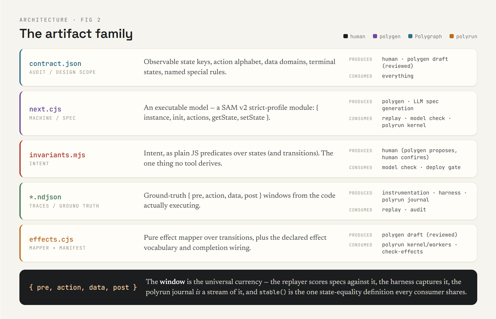](diagrams/architecture-02-artifact-family.dc.html)
*Interactive diagram — [The artifact family](diagrams/architecture-02-artifact-family.dc.html)*

## The SAM v2 strict profile — why it is the common substrate

All five engines depend on the same code shape
(`@cognitive-fab/sam-pattern`, vendored at `scripts/vendor/`): named intents
with schemas and **finite declared domains**, acceptors keyed per action, a
**sealed model** (no hidden bookkeeping state), and first-class
`reject(reason)` so every no-op is observable and classifiable via
`lastStep()`. Consequences:

- the model checker explores exactly what the module declares — zero
  harness configuration, no silently-unexplored actions;
- **rejection is a legal, observable no-op** — which is what makes stale
  timers, duplicate webhooks, and at-least-once redelivery safe in polyrun
  without any cancellation machinery;
- `getState()`/`setState()` round-trip totally over the declared shape —
  which is what makes snapshot-based durability (and replay-free deploys)
  sound;
- `instance({}).validate()` is a mechanical strict-clean gate at every
  stage boundary.

`scripts/sam-adapter.cjs` wraps any such module in the lean `{init, next}`
contract (reset-then-merge rehydration) so the BFS checker and the replayer
can never disagree about semantics.

## Engine 1 — Polygraph (audit)

[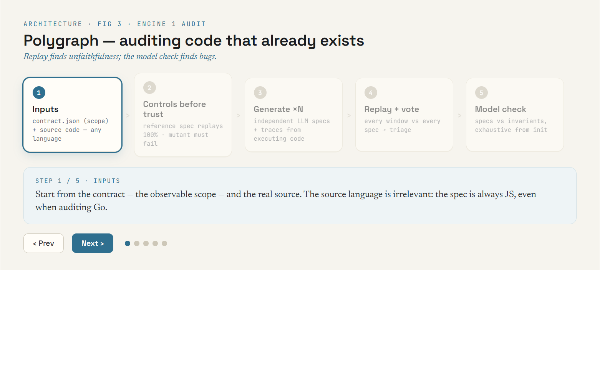](diagrams/architecture-03-polygraph-audit.dc.html)
*Interactive diagram — [Polygraph — auditing code that already exists](diagrams/architecture-03-polygraph-audit.dc.html) (step through the 5 stages)*

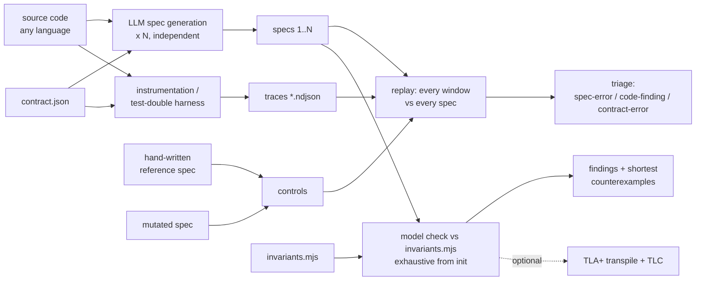

Key properties:

- **Controls before trust**: a hand-written reference spec must replay
  100% and a deliberately mutated one must fail, proving the harness can
  tell good from bad, before any generated spec means anything.
- **N-way voting**: several independently generated specs; one bad
  generation cannot decide the outcome. Disagreements triage into
  spec-errors (LLM misread), code-findings (investigate), contract-errors
  (mis-scoped).
- **Replay finds unfaithfulness; the model check finds bugs**: a faithful
  spec reproduces the code's bugs, so replay alone cannot see them — the
  exhaustive iteration against *intent* invariants is what surfaces the
  reachable bad state, with a shortest action path as a ready repro.
- Source language is irrelevant (the spec is always JS): the
  `examples/polygraph-oms-go` audit derives specs from **Go** and captures
  ground truth by driving the unmodified Go workflow through Temporal's own
  testsuite.

## Engine 2 — polygen (author)

> Introduction: [`polygen.md`](polygen.md) — what it's for and why
> verification-before-shipping changes what a clean result means.

[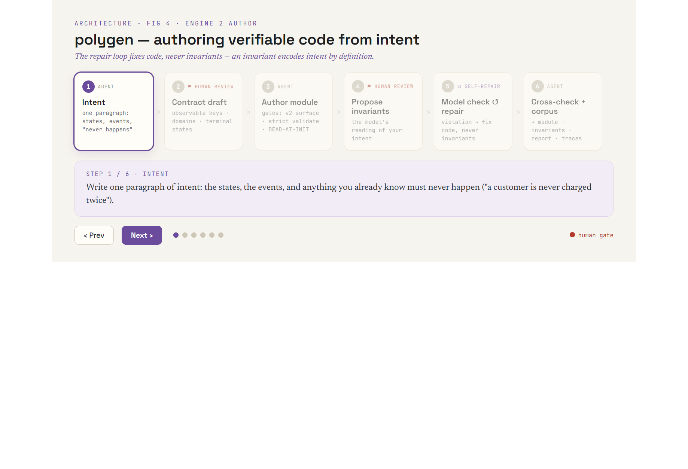](diagrams/architecture-04-polygen-author.dc.html)
*Interactive diagram — [polygen — authoring verifiable code from intent](diagrams/architecture-04-polygen-author.dc.html)*

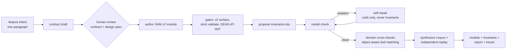

Key properties:

- **The repair loop fixes code, never invariants** — an invariant encodes
  intent by definition.
- Every stage boundary is gated: unloadable/truncated output retries once
  with the error fed back; a module that validates strict-clean but is
  **dead at init** (e.g. the `name:`-component local-state binding) is
  refused with the diagnosis in the retry prompt.
- The **contract/code domain cross-check** catches enum-spelling and
  domain-reference gaps between the two independent model calls (recursing
  into object-valued domain entries to their scalar leaves).
- A run that did not converge says so — the report never presents partial
  verification as clean, and recorded hand-repairs live next to the
  unconverged report (see `examples/polyrun-oms/machines/order/REPAIR-NOTE.md`).

## Engine 3 — polyrun (execute)

Full spec: `docs/polyrun-spec.md`. The short version:

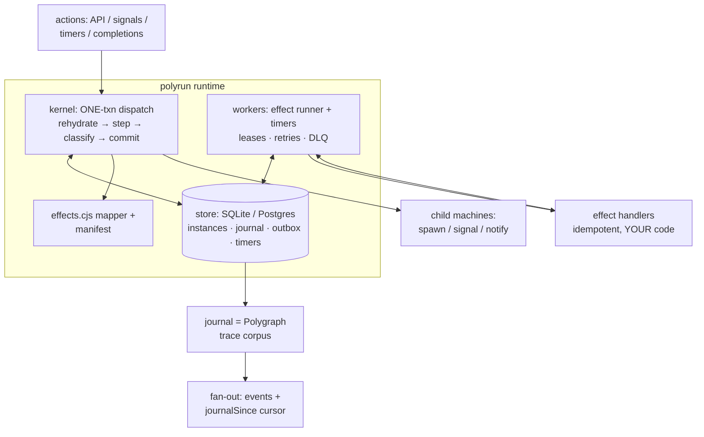

- **Snapshot durability, not event-sourced replay**: rehydration is
  `init()+setState()`; deploys are gated on snapshot compatibility (plus
  model-checking live snapshots as initial states) — no determinism
  sandbox, no `patch()` versioning.
- **One transaction per step** (dedupe read included): journal row,
  snapshot, effect intents, and timers commit together or not at all.
  Effects are **emitted exactly once, executed at least once** under
  idempotency keys; completions dispatch before row marks on every path.
- **Poison doctrine**: anything "cannot happen" for a verified module —
  mid-step throws, unreadable classifications, rejected snapshots, mapper
  defects — durably poisons the *faulty* instance, loudly. A caller's
  schema-invalid payload is an observable reject, not a poison.
- **The verification flywheel**: `polyrun check-effects` explores the
  machine ∘ mapper composition against emission invariants ("no path emits
  chargeCard twice", "spawns exactly N children") reproducing the kernel's
  poison rules statically; `polyrun check-product` explores the JOINT
  parent×child state space against cross-machine invariants ("no shipment
  delivers under a cancelled order") — the composition class no
  single-machine check can see; `polyrun simulate` drives the same fleet
  through the REAL kernel on seeded schedules (store faults, duplicate
  deliveries, stale actions) with the model stepped in lockstep, so
  model↔kernel drift surfaces as a finding; `polyrun deploy` gates releases
  over live state; `polyrun audit` replays the production journal through
  the module and reports drift, version-aware.

## Engine 4 — polyvers (evolve)

[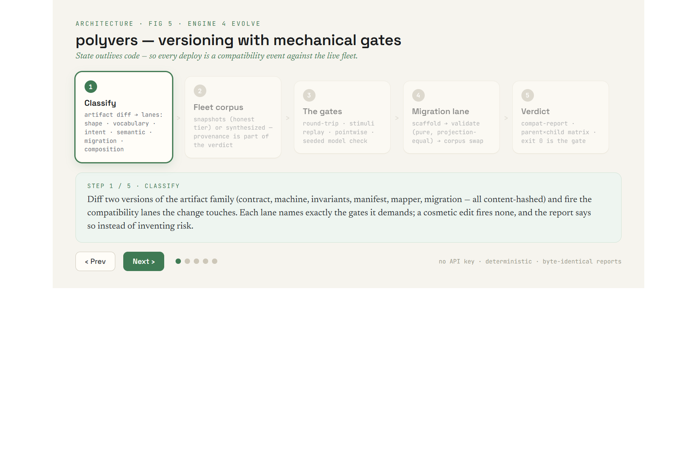](diagrams/architecture-05-polyvers-evolve.dc.html)
*Interactive diagram — [polyvers — versioning with mechanical gates](diagrams/architecture-05-polyvers-evolve.dc.html) (step through the 5 stages)*

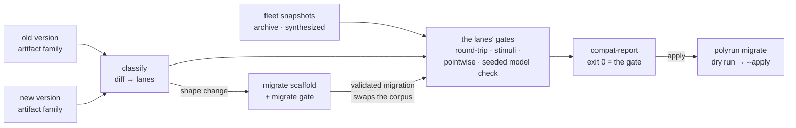

The engine that makes `docs/VERSIONING.md` executable (full plan and
milestones: `docs/polyvers-plan.md`; worked example:
`examples/polyvers-oms/`). The essence:

- **Classify before checking**: a content-hashed diff of the artifact family
  fires compatibility lanes — shape, vocabulary, intent, semantic,
  migration, composition — and each lane names exactly the gates it demands.
  A cosmetic edit fires none, and the report says so.
- **Fleet states are the test inputs**: `polyrun archive` exports (the
  honest tier) or BFS-synthesized old-machine states (the weakest tier —
  disclosed as such). The headline gate seeds the exhaustive model check
  with those snapshots: *can any live state be **driven** to an invariant
  violation under the new rules?* — the v1-reachable/v3-unreachable
  landmine hunt, mechanized.
- **Cross-version delivery, checked**: every stimulus the old version could
  still deliver (timers, completions, old-vocabulary callers) must land on
  the new machine as accepted or a *named* observable reject — the same
  doctrine that makes at-least-once delivery safe, applied across the
  version boundary. `polyvers matrix` extends it to parent×child rollout
  pairings over the spawn/completion protocol.
- **Migration as a gated artifact**: scaffolded from the shape diff
  (complete for pure additions, throwing TODO holes for the rest),
  validated fleet-wide — pure, accepted, projection-equal, state *and*
  transition invariants — and then the corpus swaps so every downstream
  gate runs over post-migration states. Apply remains `polyrun migrate`.
- **Refusals over vacuous passes**: empty corpus, missing invariants,
  unreadable stimulus set, BOUNDED exploration — each is a failing verdict
  with the reason named, never a silent green. No API key anywhere.

## Engine 5 — polynv (elicit)

[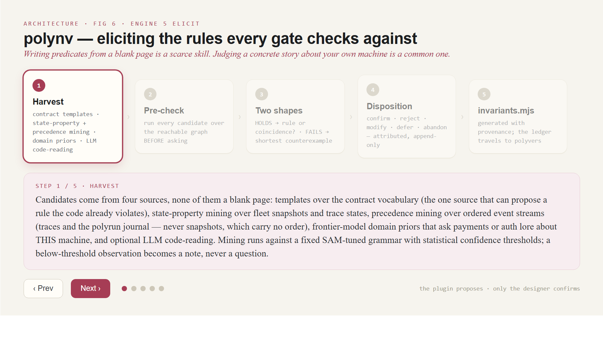](diagrams/architecture-06-polynv-elicit.dc.html)
*Interactive diagram — [polynv — eliciting the rules every gate checks against](diagrams/architecture-06-polynv-elicit.dc.html)*

The engine that attacks the ceiling the trust-boundaries table below names:
every gate is exactly as good as `invariants.mjs`, and invariant-writing is
a scarce skill. polynv converts it into a common one — judging concrete
stories — via a plugin-led interview (full plan and the literature
anchoring: `docs/polynv-plan.md`; worked example + calibration:
`polynv/README.md`). The essence:

- **Harvest before asking**: contract-vocabulary templates (the source that
  can propose rules the code violates), state-property mining over
  snapshots and trace states plus precedence mining over ordered event
  streams — traces and the polyrun journal; never snapshots, which carry
  no order — (fixed SAM-tuned grammar,
  statistical confidence thresholds), frontier-model domain priors
  (payments lore asked about *this* machine), LLM code-reading — every
  candidate pre-checked so the question arrives as "rule or coincidence?"
  (HOLDS) or "this concrete sequence is possible today — acceptable?"
  (shortest counterexample).
- **The plugin leads; the designer dispositions**: confirm / reject /
  modify (re-checked, consequence-diffed) / defer (to a named person) —
  attributed, append-only, in `intent-ledger.json`. Generation never holds
  acceptance; a model may propose, only the designer confirms.
- **The adequacy grade**: mutate the machine (four operator families),
  discard behaviorally-equivalent mutants by graph comparison (decidable
  here — the finite-domain restriction paying the toolset back), and grade
  the confirmed set by kill ratio; survivors become the next questions,
  and polyvers disclosures carry the score (or STALE once the invariants
  drift from the graded oracle).

[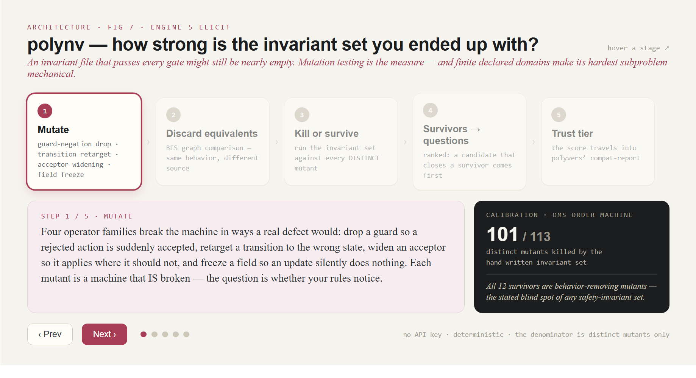](diagrams/architecture-07-polynv-grade.dc.html)
*Interactive diagram — [polynv — the adequacy grade](diagrams/architecture-07-polynv-grade.dc.html)*

## Trust boundaries

| layer | correctness argument |
|---|---|
| machine logic | exhaustive model check vs invariants (per machine, over its declared finite action/data domains) |
| data abstraction (declared domain vs real data) | **human judgment** — someone picks the representative values; no gate measures whether they exercise every boundary the code branches on |
| invariant-set strength | **partially measured**: polynv's mutation adequacy grade (kill ratio over behaviorally distinct machine mutants, equivalents discarded by graph comparison, disclosed in the compat-report) — with its blind spot stated: behavior-REMOVING mutants largely evade safety invariants |
| machine ∘ mapper composition | check-effects path exploration incl. emissions, spawns, timer validity |
| parent×child composition (joint interleavings) | `polyrun check-product` exhaustive joint-state check vs cross-machine invariants (abstraction/PCT for scale); `polyvers product` per rollout-window version pairing; `polyrun simulate` falsifies the same invariants against the real kernel — open: grandchildren, joint mid-flight seeding |
| version compatibility | polyvers lanes/gates over fleet snapshots — exactly as good as the stated invariants and the corpus tier (both disclosed in the report) |
| kernel + stores + workers | `polyrun simulate` — seeded DST over the real kernel: model-in-lockstep parity per dispatch, injected store faults + at-least-once redelivery, duplicate/stale deliveries, continuous journal audit (sampled schedules, not exhaustive) — plus the nondeterministic soak, fault-injection tests, and adversarial review; small, fixed, logic-free by design |
| effect handlers | **yours**: must be idempotent under the provided key (same division as Temporal activities) |
| contract & invariants | **human judgment** — the one thing no tool derives; a converged run against wrong intent proves nothing. polynv makes the judgment cheaper to exercise (harvested, pre-checked candidates; consequence-anchored questions; an attributed ledger) — the designer's disposition remains the gate |

## Design doctrines (recurring, load-bearing)

1. **No silent-clean paths** — a run that verified nothing must never look
   like a pass (bounded exploration exits nonzero; empty invariant sets are
   refused; skipped instances are reported).
2. **Observable rejection** — every not-applicable action is
   `reject(reason)`, contract-anchored to the rule's name.
3. **Controls before trust** — positive and negative controls precede any
   generated-artifact claim.
4. **Ground truth is executed code** — traces come from the real thing
   running (instrumented app, test-double harness, or the polyrun journal),
   never from expectations.
5. **Defect → gate** — every generation/harness failure discovered becomes
   a mechanical gate so the next run cannot repeat it.

## Worked examples (the OMS quartet)

- `examples/polyrun-oms` — Temporal's OMS reference app **rebuilt** on
  polyrun; every machine polygen-authored.
- `examples/polygraph-oms-go` — the same app's actual Go source
  **audited**: real-execution traces, controls, three generated specs,
  unanimous model-check findings.
- `examples/polyvers-oms` — the same order machine **versioned**: a
  shape+rules+intent change, the scaffolded migration, the committed
  compat-report, and the parent×child rollout matrix.
- `polyrun/demo` — the kill -9 mid-charge recovery demo.

See `docs/SDLC.md` for how teams thread these engines into their
development lifecycle and agentic workflows.
