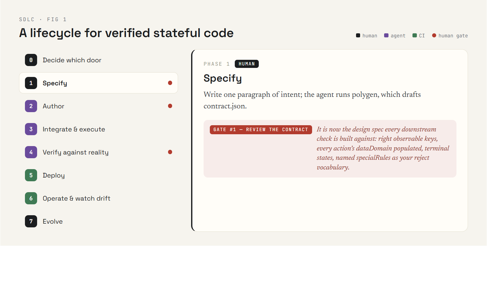
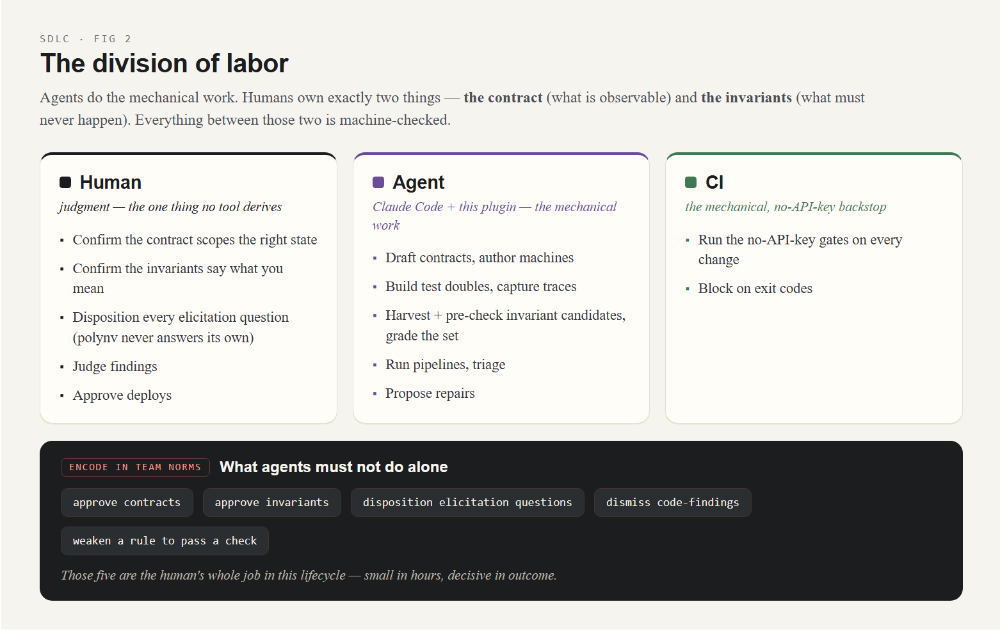
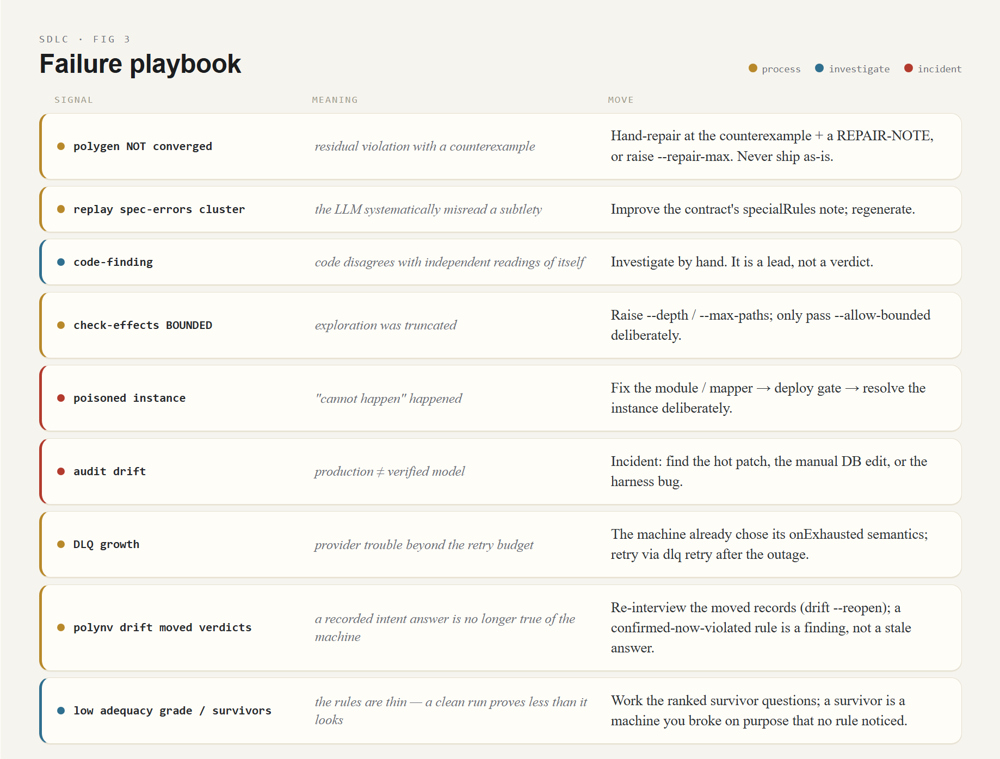

# An SDLC for verified stateful code — integrating Polygraph, polygen, and polyrun into agentic workflows

This document is the team-facing companion to `docs/ARCHITECTURE.md`. It
describes a development lifecycle in which **agents do the mechanical work**
(authoring, instrumentation, exploration, triage) and **humans own exactly
two things**: the contract (what is observable) and the invariants (what
must never happen). Everything between those two is machine-checked.

The division of labor, stated once and used everywhere:

| | responsibility |
|---|---|
| **human** | confirm the contract scopes the right state; confirm invariants say what you mean; judge findings; approve deploys |
| **agent** (Claude Code + this plugin) | draft contracts, author machines, build test doubles, capture traces, run pipelines, triage, propose repairs |
| **CI** | run the no-API-key gates on every change; block on exit codes |

[](diagrams/sdlc-01-lifecycle.dc.html)
*Interactive diagram — [A lifecycle for verified stateful code](diagrams/sdlc-01-lifecycle.dc.html) (click through phases 0–7)*

[](diagrams/sdlc-02-division-of-labor.dc.html)
*Interactive diagram — [The division of labor](diagrams/sdlc-02-division-of-labor.dc.html)*

---

## Phase 0 — Decide which door you are entering

- **New feature with nontrivial state?** → Phase 1 (author with polygen).
- **Existing/legacy/third-party stateful code?** → Phase 4 (audit with
  Polygraph) — `examples/polygraph-oms-go` is the template, including for
  code in another language.
- **Verified machine that needs to run durably?** → Phase 3 (polyrun).

## Phase 1 — Specify (human + agent, minutes)

Write one paragraph of intent: the states, the events, and anything you
already know must never happen ("a customer is never charged twice").
The agent runs `/polygraph:polygen`; polygen drafts `contract.json`.

**Human gate #1 — review the contract.** It is now the design spec every
downstream check is built against. Check: are these the right observable
keys? Is every parameterized action's `dataDomain` populated (an absent
domain silently excludes the action from checking — the report flags this,
but read it)? Are the terminal states right? Named `specialRules` become
the reject-reason vocabulary — name them the way you want rejections to
read in production logs.

## Phase 2 — Author (agent, minutes; human reviews the output)

polygen authors the SAM v2 module, proposes `invariants.mjs`, model-checks
its own output, self-repairs violations (code, never invariants),
cross-checks contract/code domains, and synthesizes a replayed regression
corpus. For machines that will run on polyrun, it also drafts the effect
mapper + manifest.

**Human gate #2 — review the invariants.** They are the model's reading of
your intent, not ground truth. Add the rules only you know — or elicit
them: `/polygraph:polynv` runs the interview (harvested, pre-checked
candidates with counterexamples; domain priors; a mutation grade of the
resulting set), and its ledger records who confirmed what and why. The
gate stays human either way. If a "violation" during repair was actually a
misunderstanding of intent, fix the contract/invariants and re-run — never
weaken a rule to make it pass.

**Read the report's verdict literally.** `Converged` means the code
satisfies *its stated* invariants over the explored space. `NOT converged`
is not shippable: either raise `--repair-max`, or hand-repair at the
counterexample and **record it** (a `REPAIR-NOTE.md` next to the report,
with post-repair check output — see
`examples/polyrun-oms/machines/order/` for the format).

## Phase 3 — Integrate & execute (agent wires, gates check)

Two integration shapes:

**(a) Your own handler/reducer** — call the module, never reimplement it;
then treat the integration as existing code and go to Phase 4 to audit it
with real traces.

**(b) polyrun** — register the machine + contract + mapper/manifest +
invariants in a `polyrun.config.mjs`; write idempotent effect handlers
(the one part of the system whose correctness is on you — the provided
idempotency key makes it tractable). Then the composition gate:

```bash
node polyrun/bin/polyrun.mjs check-effects --config <cfg>   # emission invariants, spawn counts, timer validity
```

Write emission invariants the way you wrote state invariants: "no path
emits chargeCard twice", "spawns exactly `fulfillments` children, never
before a successful charge". This is the layer that closes the
double-charge class **pre-deploy**.

## Phase 4 — Verify against reality (agent-heavy)

Ground truth is the code executing. The agent's job (this is the step that
historically made verification expensive, and the step agents now carry):

- **In-house code**: wrap the dispatch/reducer once with
  `scripts/instrument/`, drive the scenarios (the agent builds emulators /
  fault-injection doubles as needed), collect `{pre,action,data,post}`
  windows.
- **polyrun-hosted code**: the journal already *is* the corpus —
  `polyrun export-traces`.
- **Foreign code** (other language, other runtime): build a deterministic
  harness around the real thing — the Go audit drives the unmodified
  Temporal workflow through its own testsuite with virtual-time gates.

Then:

```bash
node scripts/validate_corpus.mjs <contract> <traces>                       # corpus hygiene
node scripts/verify.mjs --contract <c> --traces <t> --specs <reference+mutant>  # CONTROLS first
node scripts/verify.mjs --contract <c> --source <src> --traces <t> --model sonnet-5 --n 5   # generate + replay (API key)
node scripts/check.mjs --spec <winning> --contract <c> --invariants <inv>  # findings + counterexamples
```

**Human gate #3 — triage findings.** Spec-errors are LLM misreadings;
code-findings are leads to investigate by hand; contract-errors mean
Phase 1 scoped wrong. A finding against a *reference or third-party* app
may be an intent observation, not a defect — write it up that way.

## Phase 5 — Deploy (mechanical gate, no API key)

```bash
node polyrun/bin/polyrun.mjs deploy --config <cfg>
```

Gates, in order: module loads strict-clean with domain cross-checks;
`setState` round-trips over **live snapshots**; state invariants hold
pointwise on live state. Shape changes require a pure `migrate.cjs`:

```bash
node polyrun/bin/polyrun.mjs migrate --config <cfg>          # validate ALL (dry run)
node polyrun/bin/polyrun.mjs migrate --config <cfg> --apply  # fenced, journaled ($migrate rows)
```

Because durability is snapshot-based, there is no replay-determinism debt:
you may rewrite the machine freely as long as the gate passes.

## Phase 6 — Operate & watch for drift

- `GET /` (ops console), `/metrics`, `rt.events` / `journalSince` for
  projections.
- `polyrun dlq ls|retry|discard` — exhausted effects; remember the machine
  already *decided* what exhaustion means via `onExhausted`.
- A **poisoned** instance is a defect alarm, not noise: the faulty machine
  hit a "cannot happen" path. Fix the module/mapper, deploy through the
  gate, then resolve the instance deliberately.
- **Continuous audit** — schedule it:

```bash
node polyrun/bin/polyrun.mjs audit --config <cfg>   # replay journal vs module, version-aware
```

Drift here means production and the verified model have diverged (hot
patch, manual DB edit, harness bug). Treat nonzero exit as an incident.

- Retention: `polyrun archive --before <t> --out <dir> --apply` (refuses
  unexported rows, unsettled effects, live parent/child links).

## Phase 7 — Evolve

Change flows through the artifacts in order: intent → contract →
invariants → machine (regenerate or repair) → check-effects → deploy gate
(→ migrate). The one rule: **invariants move first**. If you find yourself
editing the machine to change behavior the invariants don't describe, you
are reintroducing the gap this whole lifecycle exists to close.

This phase is mechanized by **polyvers** (`/polygraph:polyvers`): classify
the change into compatibility lanes, run the lanes' gates against fleet
snapshots (round-trip, old-version stimuli replay, migration validation,
and the model check *seeded from live states*), scaffold the migration when
the shape changed, and gate the deploy on the compat-report — exit 0 is the
gate, no API key. Worked example: `examples/polyvers-oms/`.

## Versioning best practices

The long-form argument is [`docs/VERSIONING.md`](VERSIONING.md); this is
the operating checklist. The premise: state outlives code, so every deploy
is a compatibility event against your live fleet — and each kind of change
has a lane with mechanical gates.

1. **Classify the change first** (see the decision table in the essay):
   semantics-only → plain deploy gate; shape change → the `migrate.cjs`
   lane; vocabulary change → contract revision with cross-checks; rule
   change → invariants move **first**, then everything else. This step is
   mechanized: `/polygraph:polyvers` (`polyvers classify --old --new`)
   names the lanes and the gates they require, and `polyvers check` runs
   them against fleet snapshots — including the seeded model check, the
   in-flight-stimuli replay, and migration validation.
2. **Run `polyrun deploy` against a copy of live state, not an empty
   database.** The gate's value is precisely that production snapshots are
   its test inputs — round-trip, pointwise invariants, and the model check
   from live states as initial states (the v1-reachable/v3-unreachable
   landmine hunt).
3. **Migrations: always dry-run first, and let the fences work.**
   `migrate` validates everything before applying anything; an instance
   that moves during the apply is skipped and reported — re-run rather
   than force. Never bypass the `$migrate` journal row: it is what keeps
   history auditable across the boundary.
4. **Treat reject-reason names as public API.** They come from the
   contract's `specialRules` and surface in journals, logs, and client
   responses — renaming one is a vocabulary change, not a refactor.
5. **Deprecate actions; don't delete them in the same release** while any
   instance, timer, or effect completion from the old version can still
   arrive. Verified stale-action rejection makes the overlap window safe —
   use it, then remove the action once the fleet and outbox have drained.
6. **Archive before large migrations** (`polyrun archive`) — a smaller
   live fleet is a smaller gate surface and a smaller blast radius.
7. **Audit right after every deploy** (`polyrun audit`, version-aware):
   pre-deploy windows report as older-version (not replayed), so any drift
   it *does* flag is real.
8. **Strengthening an invariant is a fleet event.** Expect the gate to
   name the live instances that already violate the stronger rule; decide
   what they mean *before* the deploy, not after.
9. **Cross-machine deploys (parent/child): registration cross-checks catch
   wiring breaks, but deploy parents and children in an order where every
   completion action both sides emit still exists on the receiver.** The
   product of versions is not yet model-checked (recorded scope note) —
   this is the one lane where sequencing discipline still substitutes for
   a gate.

---

## CI wiring (all no-API-key unless noted)

```yaml
# every PR
- npm test                      # pipeline self-tests
- npm run test:polyrun          # harness suite (add POLYRUN_PG_URL for Postgres)
- npm run test:oms              # or your app's suite
- polyrun check-effects --config <cfg>          # composition gate (exit 1 on violation OR bounded)
- node scripts/verify.mjs --specs <saved> ...   # replay saved specs vs committed traces
# on release
- polyvers check --old <prev> --new <next> --snapshots <archive> --out out/compat   # compatibility gate (lanes → gates)
- polyrun deploy --config <cfg>                 # against a staging copy of live state
# nightly / scheduled agent
- polyrun audit --config <cfg>                  # drift detector
- regenerate specs from source (--model, needs key) and diff verdicts
```

Exit codes are the contract: every tool here exits nonzero on any unclean
signal, including "verified less than it appears" (bounded runs, empty
invariant sets, zero-window corpora).

## Agentic workflow entry points

| you say / run | what happens |
|---|---|
| "write a verifiable X flow" → `/polygraph:polygen` | Phase 1–2 guided, with the human gates surfaced to you |
| "does this code do what I think?" → `/polygraph:polygraph` | Phase 4 end-to-end: the agent designs the contract, instruments, runs controls, triages with you |
| `/polygraph:verify` | Phase 4 when contract + traces already exist |
| "can I ship this change?" → `/polygraph:polyvers` | Phase 7: classify the version change, run the compatibility gates against fleet snapshots, scaffold the migration |
| `polygen` / `polygraph-verifier` / `polyvers` subagents | the same, handed off autonomously; review the returned report at the human gates |
| scheduled agent (cron/routine) | Phase 6: audit + DLQ review + "regenerate and diff" |

**What agents must not do alone** (encode this in your team norms): approve
contracts, approve invariants, dismiss code-findings, or weaken a rule to
make a check pass. Those four are the human's whole job in this lifecycle —
small in hours, decisive in outcome.

## Failure playbook

[](diagrams/sdlc-03-failure-playbook.dc.html)
*Interactive diagram — [Failure playbook](diagrams/sdlc-03-failure-playbook.dc.html)*

| signal | meaning | move |
|---|---|---|
| polygen NOT converged | residual violation with counterexample | hand-repair at the counterexample + REPAIR-NOTE, or raise `--repair-max`; never ship as-is |
| replay spec-errors cluster on one rule | LLM systematically misread a subtlety | improve the contract's `specialRules` note; regenerate |
| code-finding | code disagrees with independent readings of itself | investigate by hand; it is a lead, not a verdict |
| `check-effects` BOUNDED | exploration truncated | raise `--depth`/`--max-paths`; only pass `--allow-bounded` deliberately |
| poisoned instance | "cannot happen" happened | fix module/mapper → deploy gate → resolve instance |
| audit drift | production ≠ verified model | incident: find the hot patch / manual edit / harness bug |
| DLQ growth | provider trouble beyond retry budget | the machine already chose its `onExhausted` semantics; retry via `dlq retry` after the outage |
