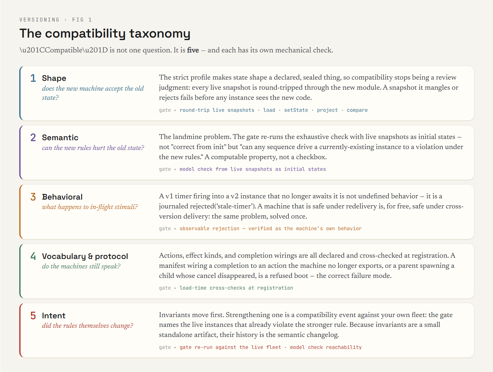
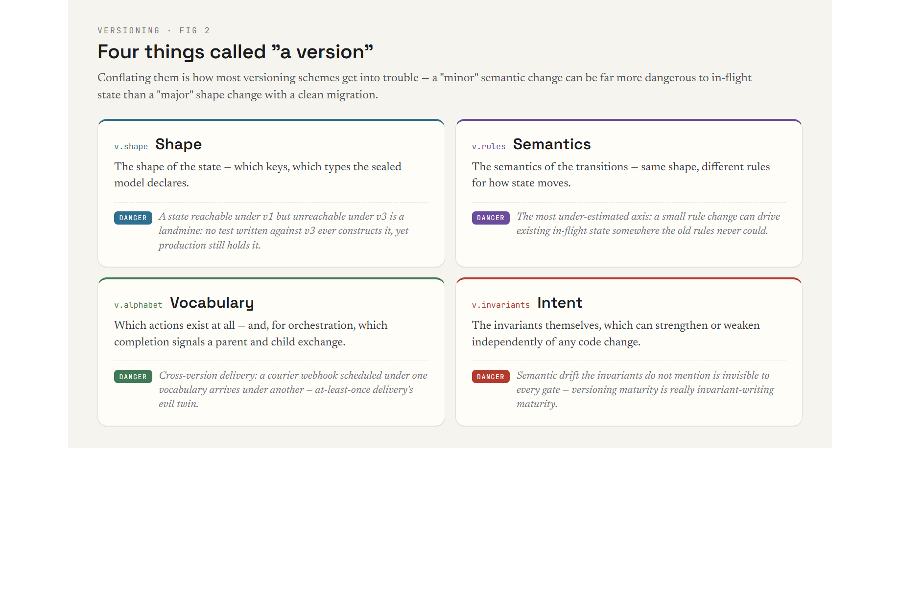
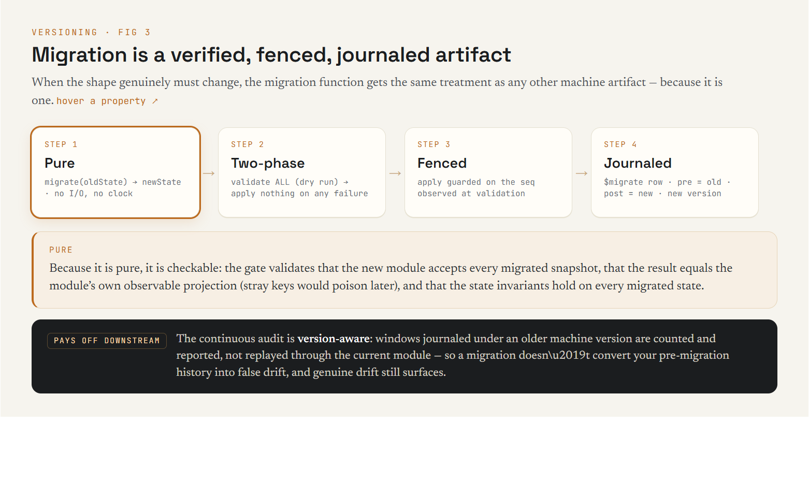

# Versioning state machines — an essay on the hardest problem this toolset touches

Versioning stateless code is a solved problem: deploy the new function,
route traffic, done. Versioning a **state machine** is a different animal,
because a state machine's most important property is the thing versioning
breaks: its state outlives its code. An order sitting in `charging` tonight
was put there by the machine you wrote last month, and it will be finished
by the machine you deploy tomorrow. Every long-running workflow system
lives or dies on how it answers one question: *what happens to in-flight
state when the logic changes?*

This essay lays out why the problem is genuinely hard, the taxonomy of
compatibility it decomposes into, how the Polygraph/polygen/polyrun triad
addresses each piece, and — honestly — what remains open.

*Interactive diagram — [The compatibility taxonomy](diagrams/versioning-01-taxonomy.dc.html)*

## Why it is hard

**1. The state is the contract you didn't know you signed.** Every
persisted instance is a promise that some future version of your code will
know what to do with it. Unlike an API, nobody wrote this contract down —
it is implied by whatever states were *reachable* under every version you
ever deployed. A state that was reachable under v1 but is unreachable under
v3 is a landmine: no test written against v3 will ever construct it, yet
production still holds it.

**2. There are at least four different things called "a version."** The
*shape* of the state (which keys, which types). The *semantics* of the
transitions (same shape, different rules). The *vocabulary* (which actions
exist at all — and, for orchestration, which completion signals a parent
and child exchange). And the *intent* — the invariants themselves, which
can strengthen or weaken independently of any code change. Conflating these
is how most versioning schemes get into trouble: a "minor" semantic change
can be far more dangerous to in-flight state than a "major" shape change
with a clean migration.

*Interactive diagram — [Four things called "a version"](diagrams/versioning-02-four-versions.dc.html)*

**3. The dominant industrial answer creates permanent debt.** Event-sourced
replay engines — Temporal is the best of them — reconstruct state by
re-executing workflow code against recorded history. This has a real
virtue: the history is a perfect audit of past decisions. But it couples
the past to the present *forever*: workflow code must stay deterministic
with respect to every history it might replay, so every behavioral change
must be wrapped in `patch()`/`GetVersion` branches, old code paths must be
kept alive until the last old execution drains, and the whole thing runs in
a sandbox to keep you honest. Versioning becomes a discipline you practice
on every change, indefinitely — and it verifies nothing about whether the
new logic is *safe* for old state. It only guarantees the old state can be
*reconstructed*.

**4. Migration is a program, and programs have bugs.** When the shape must
change, someone writes a function from old states to new states. That
function is usually the least-tested code in the system, it runs exactly
once, against every instance at once, racing live traffic — and when it is
wrong, it is wrong durably.

**5. Time doesn't stop for the deploy.** Timers armed by v1 fire into v2.
Effect completions requested by v1 land in v2. A courier webhook scheduled
under one vocabulary arrives under another. Cross-version delivery is
at-least-once delivery's evil twin, and most systems handle it the same
way they handle everything unexpected: undefined behavior, discovered in
production.

## The compatibility taxonomy, and what checks each level

The triad's answer starts by refusing to treat "compatible" as one
question. It is five, and each has its own mechanical check:

### Shape compatibility — *does the new machine accept the old state?*

The SAM v2 strict profile makes state shape a **declared, sealed** thing:
`setState()` round-trips totally over the declared model shape, and writes
outside it throw. So shape compatibility stops being a code-review judgment
and becomes a test you run against reality: `polyrun deploy` takes every
**live production snapshot** and round-trips it through the *new* module —
load, `setState`, project, compare canonically. A snapshot the new machine
mangles or rejects fails the gate before any instance sees the new code.
This is the check event-sourced replay never gives you, because replay
doesn't ask "is the old state acceptable?" — it asks "can I rebuild it?",
which is a different and weaker question.

### Semantic compatibility — *can the new rules hurt the old state?*

This is the landmine problem, and it is where model checking earns its
place in a versioning story. The deploy gate's strongest tier re-runs the
exhaustive check with **live snapshots as initial states**: not "is the new
machine correct from `init`" but "is there any sequence of actions that
drives any *currently existing* instance into a state that violates the
invariants, under the new rules." The v1-reachable/v3-unreachable landmine
is exactly what this finds — the checker doesn't care whether v3 could
have constructed the state; it cares what v3 will *do* with it.

Semantic compatibility thus gets a precise definition the industry has
lacked: **v(n+1) is semantically compatible with v(n)'s fleet iff every
live v(n) state satisfies the invariants and cannot be driven to a
violation under v(n+1)'s transition function.** That's a computable
property, not a review checkbox.

### Behavioral compatibility — *what happens to in-flight stimuli?*

Timers and completions that cross the version boundary are handled by the
same doctrine that handles at-least-once delivery within a version:
**observable rejection**. In a strict-profile machine, every action that
does not apply in the current state is `reject(reason)` — a journaled,
explained no-op, verified as part of the machine's own checked behavior. A
v1 timer firing into a v2 instance that no longer awaits it isn't
undefined behavior; it is a `rejected('stale-timer')` row in the journal.
The deep point: **a machine that is safe under redelivery is, for free,
safe under cross-version delivery** — the two problems are the same
problem, and the toolset solves it once, at the verification layer, instead
of twice at the infrastructure layer.

### Vocabulary and protocol compatibility — *do the machines still speak?*

Actions, effect kinds, and completion wirings are all **declared**: the
contract's action alphabet, the effect manifest's `onSuccess`/`onFailure`/
`onExhausted` targets, a spawn's `onComplete`/`onParentTerminal`. Every
declaration is cross-checked at registration — a manifest wiring a
completion to an action the machine no longer exports, or a parent spawning
a child whose cancel action disappeared, is a **load-time error**, not a
runtime surprise three weeks after the deploy. Renaming an action is
therefore loud by construction; the failure mode of vocabulary drift is a
refused boot, which is the correct failure mode.

### Intent compatibility — *did the rules themselves change?*

The SDLC's one-line law — *invariants move first* — is really a versioning
statement. Strengthening an invariant is a compatibility event against your
own fleet: the deploy gate will tell you whether live state already
violates the stronger rule (and the model check whether it can be driven
to). Weakening one is a decision that deserves a diff in review, not an
accident of code drift. Because invariants are a small standalone artifact,
their history *is* the semantic changelog of the system — something no
amount of code-diff reading reconstructs reliably.

## Migration as a verified, journaled, fenced artifact

*Interactive diagram — [Migration is a verified, fenced, journaled artifact](diagrams/versioning-03-migration.dc.html)*

When the shape genuinely must change, the migration function gets the same
treatment as any other machine artifact, because it is one:

- **Pure** — `migrate(oldState) → newState`, no I/O, no clock. Which means
  it is *checkable*: the gate validates that the new module accepts every
  migrated snapshot, that the result equals the module's own observable
  projection (stray keys a lenient module tolerates would poison later),
  and that the state invariants hold on every migrated state.
- **Two-phase** — validate *everything*, apply *nothing* on any failure. A
  fleet is never left half-migrated by instance #4,217's weird state.
- **Fenced** — each apply is guarded on the seq observed at validation
  time; an instance that took a live dispatch in between is skipped and
  reported, never silently overwritten with `migrate(staleState)`.
- **Journaled** — every applied migration writes a `$migrate` row: pre =
  old snapshot, post = new, stamped with the new machine version, bumping
  the sequence. The journal's chain (`every step's pre equals the previous
  accepted post`) survives the migration, `getStateAt` stays coherent, and
  the migration is *in the audit trail* rather than being the event that
  invalidates it.

That last point pays off downstream: the **continuous audit is
version-aware**. Windows journaled under an older machine version are
counted and reported, not replayed through the current module — so a shape
migration doesn't convert your entire pre-migration history into false
drift, and genuine drift (a hot patch, a manual DB edit) still surfaces.
Compare the alternative: in most systems, a migration is precisely the
moment your history stops being checkable.

## What replay-based versioning gets that we must earn back

Honesty requires the other column of the ledger. Event-sourced history
gives Temporal one thing snapshots do not: a complete record of *which
decisions were made by which code*, reconstructible at any point. The triad
earns this back piecewise rather than getting it for free — the journal
records every step's `machine_version`, migrations leave explicit
`$migrate` records with both states, and the trace corpus per version can
replay against that version's spec. It is a reconstruction of the same
guarantee at the *observable* level rather than the execution level. For
most purposes that is enough, and it costs no determinism sandbox; but if
your compliance regime requires replaying the literal decision procedure of
eighteen months ago, event sourcing still holds that card.

The other honest trade: replay versioning makes it *possible* (if painful)
for one worker to serve arbitrarily old in-flight executions indefinitely.
The snapshot model instead **forces the compatibility question at deploy
time** — you may not ship a version that can't accept the live fleet. We
think forcing the question early is the feature, not the bug; but it is a
constraint, and teams that habitually let years-old executions drift should
know they are choosing the migration lane more often.

## A practical decision table

| the change | the lane | the checks that gate it | the command |
|---|---|---|---|
| same shape, same vocabulary, new transition rules | plain deploy | strict validate · round-trip over live snapshots · invariants pointwise · model check from live states | `polyvers check` (semantic lane) |
| shape change | `migrate.cjs` | all of the above over `migrate(s)` · projection equality · two-phase apply · `$migrate` journaling | `polyvers migrate scaffold` + `check` (migrate gate), apply via `polyrun migrate` |
| action/effect vocabulary change | contract revision | domain cross-checks · manifest wiring checks · parent/child protocol checks at registration · stale-action rejection covers the transition window | `polyvers check` (vocabulary + stimuli gates); `polyvers matrix` for parent×child pairings |
| invariant change | intent revision, **first** | gate re-run against live fleet · model check tells you if the stronger rule is already violated or reachable | `polyvers check` (intent lane: diff + pointwise + seeded model check) |
| new machine version alongside old (A/B, per-instance) | per-step `machine_version` | mixed-version fleets supported; audit replays each window against its own version | `polyrun audit` (version-aware) |

## What remains genuinely open

Three things, stated plainly. **Cross-machine version products**: parent v2
orchestrating child v1 is protocol-checked (the wiring must exist and
type-match) but not *product model-checked* — "no reachable interleaving of
parent-v2 and child-v1 violates a cross-machine invariant" is future work,
recorded as a scope note. **Unstated intent**: every compatibility
guarantee above is relative to the invariants you wrote; semantic drift the
invariants do not mention is invisible to every gate. Versioning maturity
in this toolset is therefore mostly *invariant-writing* maturity — which we
would argue is where the effort belongs, but it is effort. **Meaning
migration**: when v2's state space has no honest image for some v1 state
(not a shape problem — a conceptual one), no pure function fixes that; the
gate will fail loudly, and a human decides what those instances *mean* now.
The toolset's contribution is that this decision arrives before the
deploy, attached to a named list of instances, instead of after it,
attached to a pager.

## The one-paragraph version

State-machine versioning is hard because state outlives code, "version"
means four different things, and the industrial default (replay
determinism) taxes every future change while verifying nothing about
safety. This toolset's answer: make the state shape a sealed declaration
so shape compatibility is a mechanical round-trip over the live fleet;
make semantics checkable so "can the new rules hurt old state" is a model
check from live snapshots rather than a review vibe; make in-flight
stimuli safe by the same verified rejection that makes redelivery safe;
make vocabulary drift a load-time error; make migration a pure, gated,
fenced, journaled artifact; and version the *audit* along with the code so
history stays checkable across the boundary. Versioning stops being a
permanent discipline practiced on every change and becomes a set of gates
you pass — with the honest caveat that the gates are exactly as good as
the invariants you bothered to state.
